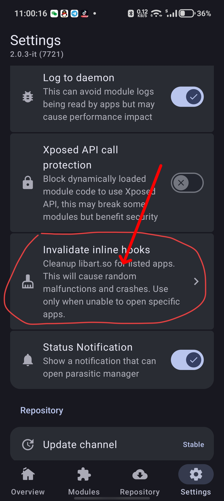
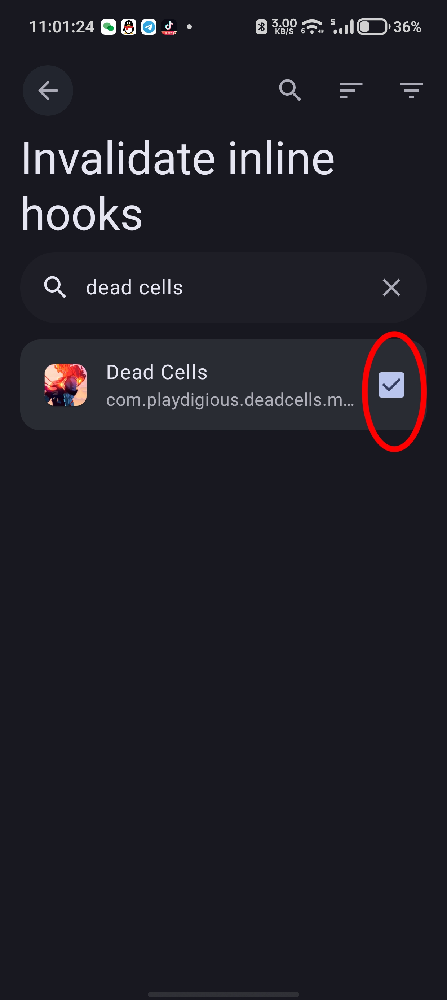

# 死亡细胞手机版模组工具箱

> [English / 英文](README.md)

基于 [libxposed/example](https://github.com/libxposed/example) 模板构建的 [LSPosed](https://github.com/LSPosed/LSPosed) 模块，同时也是一个无需 root 即可使用的 PAK/Atlas 离线工具。

> **免责声明：** 本项目通过 vibe coding（AI 辅助开发）创建。代码质量可能参差不齐。使用需自担风险。

## 功能

### Asset 注入（运行时 — 需要 LSPosed）

| 功能 | 描述 | 状态 |
|------|------|------|
| Asset 替换 | 用修改版替换 APK 中已有的 `.pak` 文件 | ✅ 可用 |
| Asset 注入 | 注入 APK 中不存在的新 `.pak` 文件 | ✅ 可用（中国版）/ 通过 PAD symlink（国际版） |
| PAD 路径重定向 | 支持 Google Play Asset Delivery 路径（国际版） | ✅ 可用 |
| Native Hook | 通过 LSPlant Hook `AAssetManager_open` + `open()` 系统调用 | ✅ 可用 |

> 若 mod 版本与游戏版本不匹配，可尝试使用 **PAK 合并** 方案：用内置合并工具将 mod 的 `.pak` 合并到游戏本体资源文件之一中（如将 `res5.pak` 合并到 `res4.pak`）。此方法强制游戏将 mod 内容视为本体资源加载，绕过版本检查——但可能引发未知问题。

### PAK 工具箱（离线 — 无需 root）

| 功能 | 描述 | 状态 |
|------|------|------|
| PAK 解包 | 将 `.pak` 文件提取为目录树 | ✅ 可用 |
| PAK 打包 | 从目录构建 `.pak`（自动保留 stamp） | ✅ 可用 |
| PAK 合并 | 将多个 `.pak` 合并为一个（同名覆盖） | ✅ 可用 |
| Atlas 解包 | 将 `.atlas`（BATL）提取为独立 PNG 精灵 + 坐标 | ⚠️ 实验性 |
| Atlas 打包 | 从精灵图片构建 `.atlas` + 纹理 PNG | ⚠️ 实验性 |

### 支持的版本

| 平台 | 包名 | 状态 |
|------|------|------|
| 哔哩哔哩（中国版） | `com.bilibili.deadcells.mobile` | ✅ 可用 |
| Google Play（国际版） | `com.playdigious.deadcells.mobile` | ✅ 可用 |

> **⚠️ 国际版特别说明：** Google Play 正版包含 **pairip**（Play Integrity / 反篡改机制）。如果你使用的是国际版，必须在 LSPosed 的模块设置中为死亡细胞勾选 **"还原内联钩子"** 选项，否则 pairip 会检测到修改并导致闪退。
>
> **国际版 PAK 注入：** 新的 `.pak` 文件（如 `res5.pak`）会被自动 symlink 到伪造的 PAD 资源包 (`AssetPackMod`) 中。游戏的 native PAD 扫描代码会自动发现并与官方 PAD 包一起加载。无需手动设置——只需将文件放入 mod 目录即可。
>
> **⚠️ PAD 版本更新：** 当死亡细胞在 Google Play 商店收到更新时，PAD 资源包需要重新下载。如果更新期间 mod 处于激活状态，PAD 重定向可能会干扰下载过程。建议在更新前**暂时禁用模块**（在 LSPosed 作用域中取消勾选），更新完成后再重新启用。
>
> 
> 

## 工作原理

模块使用多层 Hook 机制：

1. **Native asset Hook** — Hook `libandroid.so` 中的 `AAssetManager_open`、`openDir`、`getNextFileName`、`read`、`seek`/`seek64`、`close`、`getLength`/`getLength64`、`openFileDescriptor`/`openFileDescriptor64`，以及 `libc.so` 中的 `open()`（PAD 路径重定向）
2. **Java PAD Hook**（仅国际版）— Hook `Assets.getAssetPackLocation()` / `getAssetPackState()` 和 `DeadCellsLoading.initAssets()`，将新的 `.pak` 文件自动注入为伪造的 PAD 资源包 (`AssetPackMod`)，绕过 Google Play PAD IPC
3. **目录注入**（仅中国版）— `openDir` + `getNextFileName` Hook 将注入条目与原有资产一同返回，游戏 native 的 `mobile_Res_initAssets` 第二轮扫描可发现新的 `.pak` 文件

Mod 文件存放路径：
- 中国版：`/storage/emulated/0/Android/data/com.bilibili.deadcells.mobile/mod/`
- 国际版：`/data/data/com.playdigious.deadcells.mobile/files/mod/`
  （国际版受作用域存储限制，无法访问外部存储）

> **⚠️ 免 root 环境（LSPatch 及其分支）：** 模块理论上可通过 [LSPatch](https://github.com/LSPosed/LSPatch) 等免 root 框架加载，但此类环境与原生 LSPosed 存在差异，不保证可用性。对于国际版正版，LSPatch 方式需要对 APK 本体进行修补，这**必定**会触发 pairip 的反篡改检测导致闪退——除非使用的是已移除 pairip 的破解版。

## 构建

**环境要求：** Android SDK `platforms;android-37.0`、`ndk;27.0.12077973`、`cmake;3.31.6`。  
Gradle 9.4.1 由 wrapper 自动下载。

```bash
git clone https://github.com/Alhugh233/dead-cells-mobile-modding-toolbox
cd dead-cells-mobile-modding-toolbox
./gradlew assembleDebug
```

输出：`app/build/outputs/apk/debug/app-debug.apk`

## 致谢

本项目包含以下开源代码和格式参考：
- **[DCCM — Dead Cells Core Modding](https://github.com/dead-cells-core-modding/core)** — PAK / Atlas / CDB 格式实现 (MIT)
- **[alivecells](https://github.com/N3rdL0rd/alivecells)** — PAK / Atlas 格式实现及工具 (MIT)
- **[Miuix](https://github.com/compose-miuix-ui/miuix)** — Compose Multiplatform UI 组件库 (Apache 2.0)

详见 [NOTICE](NOTICE)。

## 协议

本项目基于 Apache License 2.0 许可 — 详见 [LICENSE](LICENSE)。

第三方协议：[LICENSE.DCCM](LICENSE.DCCM), [LICENSE.alivecells](LICENSE.alivecells), [LICENSE.Miuix](LICENSE.Miuix)。
